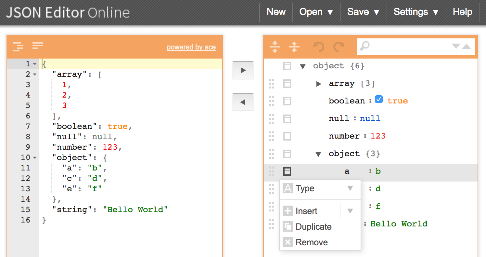

# JSON Tutorial

## Case - Lock / Unlock Settings Item

Git Log Tag: [ GSON Tutorial ] - [ Change Settings Access ]

### Solution & [codes](../../app/src/main/java/me/li2/android/tutorial/Gson/ChangeSettingsAccess/)

- **Default**: Use JSON as default configuration file, because it is easier to save all settings item with full tree structure. Save the json file in `res/raw/`.
- **View**: Use `Fragment` & `RecyclerView` to implement UI part.
- **Model**: Create data model according to **item tree structure**: `title`, `locked`, `pref-key` , `parent-item`, `sub-items`. The parent-item & sub-items are important to enter sub-level and back to high-level, and also important to update parent & sub checked status when one item is changed.
- **Model Update**: The best & easier way is to use `Preferences` to save and get the item locked status. It's hard to update Json file (find the JsonObject in the tree, then modify it, then convert JsonObject to String, then write string to file).

## Utilities

[JSON Formatter Online](http://www.freeformatter.com/json-formatter.html) 一个在线的 Json 格式化网站。只需要粘贴 Json 字串或者上传 Json 文件，选择缩进等级，然后格式化。

[JSON Editor Online](http://www.jsoneditoronline.org/) 一个在线的 Json 编辑网站。Json String 和 Json Object 可以互相生成。右侧的 Json Object 编辑器可以很方便地修改类型、插入、删除、复制，在线保存（会自动生成一个链接）或者保存到本地。

