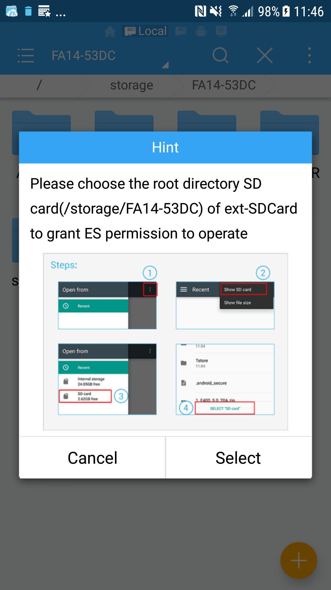
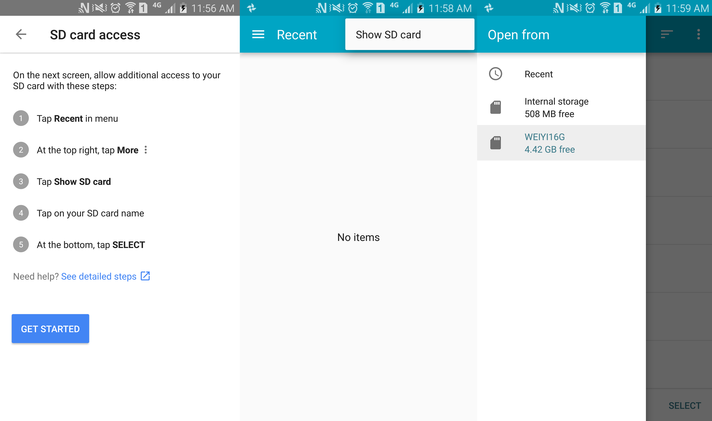

Storage Tutorial
================

Storage Options
---------------

[Android provides several options for you to save persistent application data.](https://developer.android.com/guide/topics/data/data-storage.html)

> - Shared Preferences
    Store private primitive data in key-value pairs.
      
> - Internal Storage
    Store private data on the device memory.

> - External Storage
    Store public data on the shared external storage. This can be a removable storage media (such as an SD card) or an internal (non-removable) storage
    [What are the differences among Internal storage, external storage, sd card and removable storage?](http://stackoverflow.com/questions/5092591/what-are-the-differences-among-internal-storage-external-storage-sd-card-and-r)

> - SQLite Databases
    Store structured data in a private database.

> - Network Connection
    Store data on the web with your own network server.

Getting access to external storage
----------------------------------

In order to read or write files on the external storage, your app must acquire the `READ_EXTERNAL_STORAGE` or `WRITE_EXTERNAL_STORAGE` system permissions.

    <manifest ...>
        <uses-permission android:name="android.permission.WRITE_EXTERNAL_STORAGE" />
    </manifest>

更多权限（calendar, camera, contacts, location, microphone, phone, sensors, SMS）阅读 [Requesting Permissions](https://developer.android.com/guide/topics/permissions/requesting.html):

> This page describes how apps can request standard system permissions.
> 
> Because each Android app operates in a process sandbox, apps must explicitly request access to resources and data outside their sandbox. They request this access by declaring the permissions they need for additional capabilities not provided by the basic sandbox. 

但从 Android 6.0 (API level 23) 开始，需要在运行时向用户请求权限。

Requesting Permissions at Run Time
----------------------------------

[This lesson describes how to use the Android Support Library to check for, and request, permissions.](https://developer.android.com/training/permissions/requesting.html)

> Beginning in Android 6.0 (API level 23), users grant permissions to apps while the app is running, not when they install the app.

这篇文档的示例代码演示了如何在运行时获取 contacts 权限。获取 external storage 权限同理，或者阅读这个问题 [ StackOverflow - Android 6.0 Marshmallow. Cannot write to SD Card](http://stackoverflow.com/questions/33139754/android-6-0-marshmallow-cannot-write-to-sd-card)。

external storage 包含**内置卡**和**外置卡**（参阅 Storage Options）。一些文档 [(refer to getExternalStorageDirectory)](https://developer.android.com/reference/android/os/Environment.html#getExternalStorageDirectory()) 称内置卡为 **(1) primary shared/external storage, (2) built-in external storage**，称外置卡为 **secondary storage**。和 internal storage 不同的是，连接电脑时 external storage 可以被挂载成盘。

How to get primary external storage directory?
----------------------------------------------

特别需要注意到是，API `Environment.getExternalStorageDirectory` 返回的是内置卡的路径。在内置卡创建文件的方法：

    public File createExternalFile(String folderName, String fileName) {
        try {
            String path = Environment.getExternalStorageDirectory().getAbsolutePath() + "/" + folderName;
            File dir = new File(path);
            if (!dir.exists()) {
                dir.mkdirs();
            }
            File file = new File(dir, fileName);
            if (!file.exists()) {
                file.createNewFile();
            }
            return file;
        } catch (IOException e) {
            e.printStackTrace();
            return null;
        }
    }

How to get secondary external storage directory?
------------------------------------------------

**注：在获取外置卡路径之前，已经动态获取了权限。**

在 Android 6.0 以前（API level < 23）可以通过 `System.getenv("SECONDARY_STORAGE")` 获取路径。另一种 workaround 做法是遍历 `/proc/mounts` [*link*](http://stackoverflow.com/a/13648873/2722270)。

但这两种做法从 Android 6.0 开始**失效（或者不稳定）**，`System.getenv("SECONDARY_STORAGE")` 返回 null，另一种方法虽然在 6.0.1 上测试 ok，但在 7.0 上返回无效路径 `/mnt/secure/asec`（正确路径是 `/storage/FA14-53DC`）.

这个尝试 [*link*](http://blog.fidroid.com/post/android/ru-he-zheng-que-huo-de-androidnei-wai-sdqia-lu-jing) 可以在 7.0 上获取正确路径的 string，但是以这个 string 为参数执行 `dir.mkdirs()` ，无法创建目录；即使手动在外置卡内创建一个子目录，然后在执行 `file.createNewFile()` ，导致 exception：

    java.io.IOException: Permission denied
    at java.io.UnixFileSystem.createFileExclusively0(Native Method)
        at java.io.UnixFileSystem.createFileExclusively(UnixFileSystem.java:280)
        at java.io.File.createNewFile(File.java:948)

那么到底如何获取外置卡的路径，并读写文件呢？

Access to Sdcard through Storage Access Framework
-------------------------------------------------

> Android 4.4 (API level 19) introduces the Storage Access Framework (SAF). The SAF makes it simple for users to browse and open documents, images, and other files across all of their their preferred document storage providers. A standard, easy-to-use UI lets users browse files and access recents in a consistent way across apps and providers. [*link*](https://developer.android.com/guide/topics/providers/document-provider.html)

这个到底是什么呢？以两个 App 举例：

- ES File Explorer: 当尝试删除外置卡的文件时，弹出来的提示框：
    
- Google Photo: 设置界面 Allow Photos to delete items on SD card：
    

按照操作提示选定外置卡后，就可以在外置卡中删除文件了。代码：

    // Letting the user choose the "SD card":
    startActivityForResult(new Intent(Intent.ACTION_OPEN_DOCUMENT_TREE), 21);
    
    @TargetApi(Build.VERSION_CODES.KITKAT)
    @Override
    protected void onActivityResult(int requestCode, int resultCode, Intent data) {
        if (requestCode == 21 && resultCode == RESULT_OK) {
            Uri treeUri = data.getData();
            DocumentFile pickedDir = DocumentFile.fromTreeUri(this, treeUri);
            // Grant permission
            grantUriPermission(
                    getPackageName(),
                    treeUri,
                    Intent.FLAG_GRANT_READ_URI_PERMISSION | Intent.FLAG_GRANT_WRITE_URI_PERMISSION
            );
            
            // Once taken, the permission grant will be remembered across device reboots.
            getContentResolver().takePersistableUriPermission(
                    treeUri,
                    Intent.FLAG_GRANT_READ_URI_PERMISSION | Intent.FLAG_GRANT_WRITE_URI_PERMISSION
            );
            
            // store the Uri so that can retrieve it on application startup, thus no need to ask again.
            
            // do anything you want with the files and directories the Uri includes.
            pickedDir.createDirectory("li2");
        }
    }
    

Refer [Q1](http://stackoverflow.com/questions/36862675/android-sd-card-write-permission-using-saf-storage-access-framework), [Q2](http://stackoverflow.com/questions/43066117/android-m-write-to-sd-card-permission-denied), [Q3](http://stackoverflow.com/questions/26744842/how-to-use-the-new-sd-card-access-api-presented-for-android-5-0-lollipop), [link](http://www.techotopia.com/index.php/An_Android_Storage_Access_Framework_Example).
