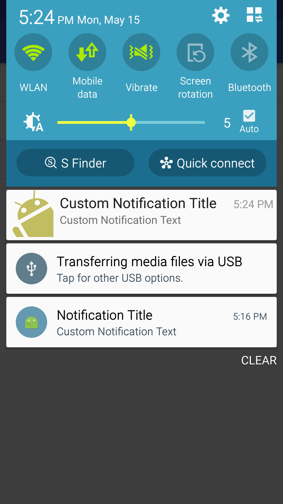
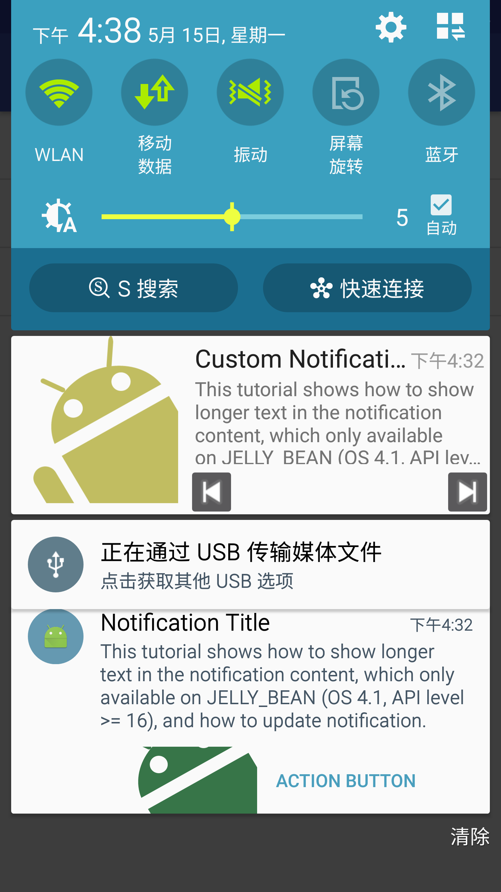

# Notification Tutorial

## Using Big View Styles


### How to customize big content view

```java
// Supply custom RemoteViews to use instead of the platform template
// in the expanded form
public Builder setCustomBigContentView(RemoteViews contentView);
```

### How to expand big content view by default

[refer](http://stackoverflow.com/questions/23331682/is-possible-set-expanded-notification-as-default-in-big-text-notifications)

> A notification's big view appears only when the notification is expanded, which happens when 
> 
> - the notification is at the top of the notification drawer, or
> - the user expands the notification with a gesture.
> 
> However, there is a trick to push the notification to the top of the list where it would be expanded: `setOngoing(true)`.

### How to update notification

[refer](https://developer.android.com/training/notify-user/managing.html)

```java
// Sets an ID for the notification, so it can be updated
mNotificationManager.notify(NOTIFICATION_ID, mNotificationBuilder.build());

// Use the SAME Builder for each update.
mNotificationBuilder.setContentText("new text");

// Because the ID remains unchanged, the existing notification is updated.
mNotificationManager.notify(NOTIFICATION_ID, mNotificationBuilder.build());
```

### How to display big text (longer text)

```java
public Builder setStyle(
    new NotificationCompat.BigTextStyle().bigText(CharSequence cs);
```


### How to fix crash - RemoteServiceException: Bad notification posted from package: Couldn't expand RemoteViews

[refer](http://stackoverflow.com/a/41363437/2722270)

> for unknown reason you are not allowed to reference dimen in the root view of the custom remote view! so you have to hard code it like `android:layout_height="128dp"`


|  |  |
|----------------------------------------|:--------------------------------------------------------:|


## TODO

notification theme is wrong on Android 7 !


## Refer


https://developer.android.com/guide/topics/ui/notifiers/notifications.html

https://developer.android.com/training/notify-user/expanded.html

https://developer.android.com/reference/android/widget/RemoteViews.html

http://www.tutorialsface.com/2015/08/android-custom-notification-tutorial/

http://www.androidbegin.com/tutorial/android-custom-notification-tutorial/

http://www.sixwolf.net/blog/2016/04/18/Android%E8%87%AA%E5%AE%9A%E4%B9%89Notification%E5%B9%B6%E6%B2%A1%E6%9C%89%E9%82%A3%E4%B9%88%E7%AE%80%E5%8D%95/
