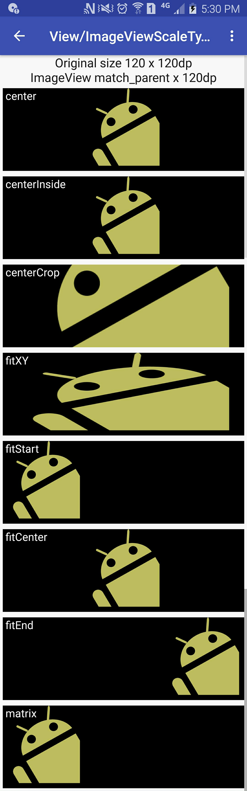
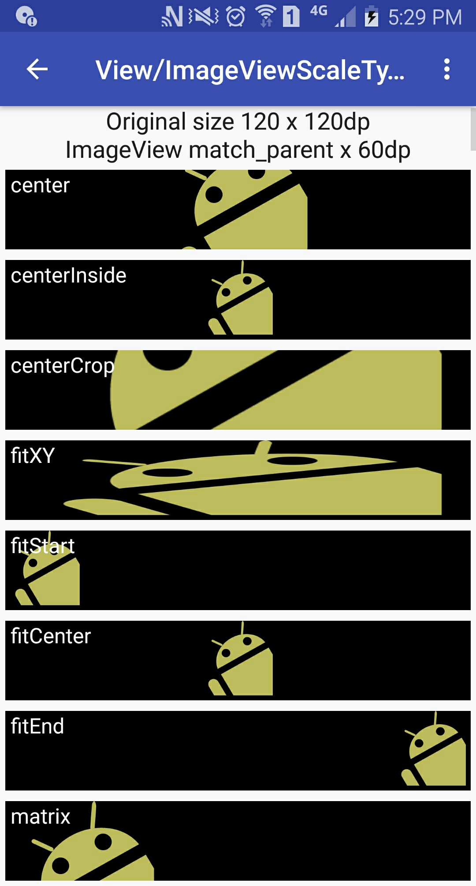
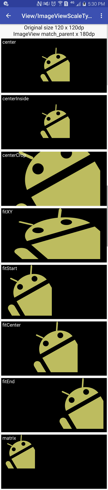

# View Tutorial

## ImageView

### `android:scaleType`

[codes](../../app/src/main/java/me/li2/android/tutorial/View)

| ScaleType      | Summary                                                                          |
|----------------|----------------------------------------------------------------------------------|
| `center`       | **NOT** scale                                                                    |
| `centerInside` | **ONLY** Scale **down** the image uniformly (maintain the image's aspect ratio). |
| `fitCenter`    | Scale **up / down** the image uniformly (maintain the image's aspect ratio).     |

| 1x                                                              | 0.5x                                                                | 1.5x                                                                |
|-----------------------------------------------------------------|---------------------------------------------------------------------|---------------------------------------------------------------------|
|  |  |  |
